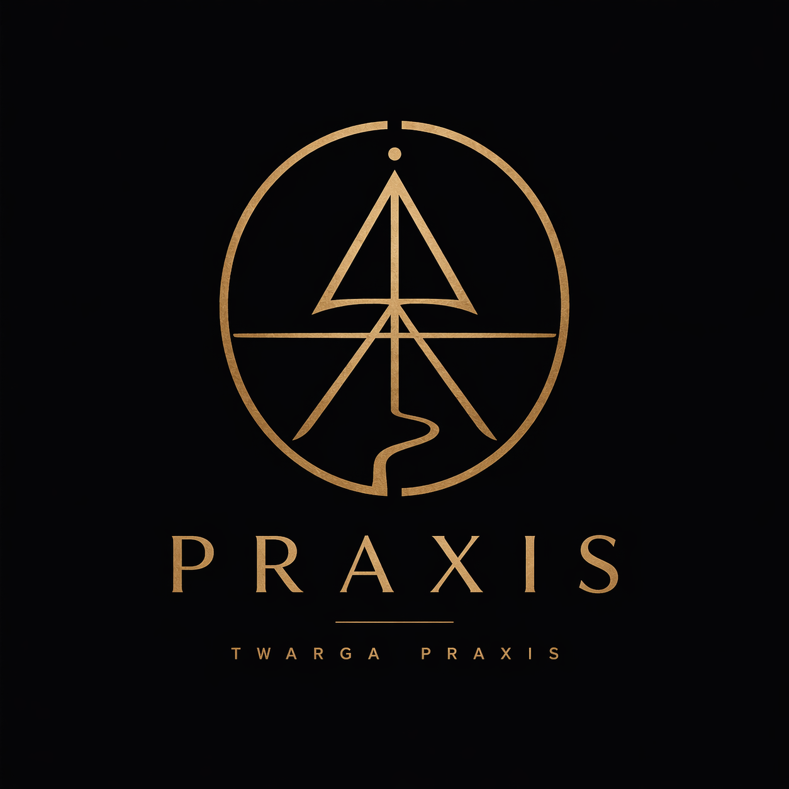

# Praxis

<p align="center">
  
</p>

<p align="center">
  A focused desktop journal for recording thoughts, transcribing them, and turning them into structured feedback over time.
</p>

<p align="center">
  
  
  
  
  
  
  
  
  
  
  
</p>

## What it is

Praxis is an AI-assisted video journaling app for desktop. Record a session, transcribe it with Whisper, analyze it with an LLM, and review how your speaking, ideas, and habits evolve over time.

## Core workflow

1. Record from webcam and microphone
2. Transcribe locally with Whisper
3. Generate structured analysis and feedback
4. Review sessions in a private desktop archive
5. Track patterns, fluency, and momentum over time

## Coming soon

- Session gallery with searchable history
- Trends and recurring pattern tracking
- External LLM fallback workflow
- LAN phone upload
- Weekly rollups
- AppImage distribution for Linux

## Tech stack

- Electron
- React
- Vite
- Tailwind CSS
- FastAPI
- Python
- faster-whisper
- LiteLLM
- OpenRouter
- FFmpeg

## Status

Early development. Planning is in place and implementation is starting from the core recording and storage pipeline outward.

## Development

Prerequisites:

- [uv](https://docs.astral.sh/uv/) (manages Python and backend deps)
- Node.js 20+
- npm
- FFmpeg

Backend setup (run once):

```bash
uv sync
```

This creates `.venv/` at the repo root with Python 3.13 and all backend deps from `pyproject.toml`.

Frontend setup (run once):

```bash
cd frontend
npm install
```

Local startup — frontend dev server:

```bash
cd frontend
npm run dev
```

In another terminal — backend:

```bash
cd backend
../.venv/bin/python -m uvicorn app.main:app --reload --port 8000
```

Then launch Electron:

```bash
cd frontend
npm run electron:dev
```

One-terminal dev runner:

```bash
./scripts/dev.sh run
```
