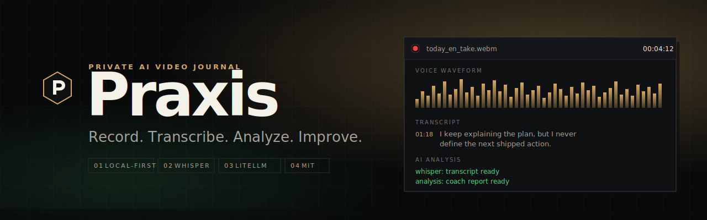

<div align="center">

<a href="https://twarga.github.io/praxies/">
  
</a>

<p>
  <a href="https://github.com/Twarga/praxies/releases/latest">
    
  </a>
  <a href="LICENSE">
    
  </a>
  <a href="https://twarga.github.io/praxies/">
    
  </a>
  <a href="https://python.org">
    
  </a>
  <a href="https://react.dev">
    
  </a>
  <a href="https://electronjs.org">
    
  </a>
  <a href="https://github.com/SYSTRAN/faster-whisper">
    
  </a>
  <a href="https://github.com/BerriAI/litellm">
    
  </a>
  <a href="https://github.com/Twarga/praxies/releases/latest">
    
  </a>
</p>

<p>
  <a href="https://twarga.github.io/praxies/"><b>Landing</b></a> ·
  <a href="https://github.com/Twarga/praxies/releases"><b>Releases</b></a> ·
  <a href="CHANGELOG.md"><b>Changelog</b></a> ·
  <a href="https://github.com/Twarga/praxies/issues"><b>Issues</b></a> ·
  <a href="CONTRIBUTING.md"><b>Contributing</b></a> ·
  <a href="SCOPE.md"><b>Scope</b></a>
</p>

</div>

---

## Table of contents

- [What's new in v0.1.0](#-whats-new-in-v010)
- [Features](#-features)
- [Screenshots](#-screenshots)
- [Quick start](#-quick-start)
- [Usage](#-usage)
- [Settings](#-settings)
- [Output structure](#-output-structure)
- [Architecture](#-architecture)
- [Troubleshooting](#-troubleshooting)
- [Roadmap](#-roadmap)
- [Privacy](#-privacy)
- [License](#-license)

---

## ✨ What's new in v0.1.0

- 🎥 **Full recording pipeline** — webcam + mic, chunked MediaRecorder, automatic crash recovery
- 🗣️ **Local Whisper transcription** — faster-whisper runs offline; timestamped segments, SRT/VTT/JSON exports
- 🤖 **Multi-provider AI** — OpenRouter, OpenAI-compatible endpoints, or a LiteLLM proxy; swap per session
- 📊 **Coach-style reports** — scorecards, timestamped moments, lessons, and next-session practice drills
- 🌍 **Translate & burn in subtitles** — render `video_subtitled_<lang>.mp4` in one click
- 📱 **LAN phone upload** — scan a QR code to push a recording from your phone into your journal
- 🔥 **Streaks & patterns** — weekly rollups, recurring behavior tracking, filler-word detection
- 📦 **Linux AppImage** — bundled Python runtime, static FFmpeg, `.sha256` checksum, install script

See the full [CHANGELOG](CHANGELOG.md).

---

## ✨ Features

| | Feature | Description |
|---|---|---|
| 🎥 | **Record anywhere** | Webcam + mic, chunked recording, auto-save, crash recovery on relaunch |
| 🧠 | **Local transcription** | faster-whisper runs on your machine — no audio ever leaves the box |
| 🗣️ | **Coach reports** | Scorecards, "moments to study," concrete lessons, next-session drills |
| 🌐 | **Multi-language** | Whisper auto-detects; translate subtitles and burn them into an MP4 |
| 🔌 | **Provider-agnostic AI** | OpenRouter, OpenAI-compatible, LiteLLM proxy — your key, your model |
| 📈 | **Trends & streaks** | Fluency charts, recurring patterns, filler-word tracking, weekly rollups |
| 📲 | **Phone → desktop** | Scan a QR code to send a recording from your phone into your journal |
| 💾 | **Local-first archive** | Plain files in a folder you choose — no account, no cloud, no sync |
| 🧰 | **Fallback workflow** | Export a prompt, paste the analysis back if you prefer a browser LLM |
| 🔐 | **MIT + open source** | Read the code, fork it, audit the flow, bring your own model |

---

## 🖥️ Screenshots

> A live, interactive preview is on the [landing page](https://twarga.github.io/praxies/).
> App screenshots will land here as the UI redesign ships. See
> [`docs/UI_REDESIGN_SPEC.md`](docs/UI_REDESIGN_SPEC.md) for the direction.

---

## 🚀 Quick start

### Requirements

- **Linux x86_64** (AppImage). macOS/Windows build from source — native builds land in v1.
- **4 GB RAM** minimum for Whisper `base`, 8 GB+ for `medium`/`large`
- **Webcam + microphone** (or use the LAN phone-upload path)

### Download (end user)

```bash
# Pick up the AppImage + checksum from the latest release
curl -LO https://github.com/Twarga/praxies/releases/latest/download/Praxis-0.1.0.AppImage
curl -LO https://github.com/Twarga/praxies/releases/latest/download/Praxis-0.1.0.AppImage.sha256

# Verify
sha256sum -c Praxis-0.1.0.AppImage.sha256

# Run
chmod +x Praxis-0.1.0.AppImage
./Praxis-0.1.0.AppImage
```

Or grab the release tarball and run the bundled installer to create a launcher and `.desktop` entry:

```bash
./scripts/install.sh
```

### Build from source (dev)

```bash
git clone https://github.com/Twarga/praxies.git
cd praxies

# Python backend (uv handles .venv/)
uv sync

# Frontend
cd frontend && npm install && cd ..

# Run backend + Vite + Electron together
./scripts/dev.sh run
```

First launch walks you through **journal folder**, **goal**, **language**, **LLM provider**, and **Whisper model**. Everything from that moment on is plain files in the folder you picked.

---

## 📖 Usage

Praxis runs one tight loop. Record, let it transcribe and analyze, read the report, practice the drill, record again.

```
┌──────────────────────────────────────────────────────┐
│  ● REC   today_en_take.webm             00:04:12     │
├──────────────────────────────────────────────────────┤
│   [ camera preview ]      ▂▅▇▃▆▂▇▄▆▃▅▇▂▅▃▆▇▄  wave   │
├──────────────────────────────────────────────────────┤
│   01:18   I keep explaining the plan, but I never    │
│           define the next shipped action.            │
├──────────────────────────────────────────────────────┤
│   whisper:  transcript ready                         │
│   analysis: coach report ready                       │
│   lesson:   name the real blocker earlier            │
│   practice: answer in 2 min with one concrete win    │
└──────────────────────────────────────────────────────┘
```

1. **Record** — webcam + microphone, chunked to disk so a crash does not lose the session
2. **Transcribe** — faster-whisper runs locally with timestamped segments and SRT/VTT/JSON exports
3. **Analyze** — the transcript goes to the LLM provider you configured; output is parsed into a scorecard, "moments to study", lessons, and a practice drill
4. **Review** — session detail shows the report, a waveform, subtitle tracks, and re-analysis with a different model in one click
5. **Track** — the Stats page aggregates specificity, actionability, fluency, streaks, and recurring patterns across sessions

### Phone upload (same LAN)

Open **Upload → Phone**, scan the QR with your phone browser, pick a video, hit send. The recording lands in your journal folder and runs through the same pipeline.

### Fallback (no LLM key)

Export the prompt from any session, paste it into whichever chat LLM you already use, paste the response back. Praxis stores it as a normal analysis.

---

## ⚙️ Settings

Set during first-run onboarding and editable any time from the Settings page.

| Setting | Default | Description |
|---|---|---|
| Journal folder | `~/TwargaJournal` | Where every session and artifact is stored |
| Preferred language | `en` | Transcription language (auto-detect stays on) |
| Session goal | *(user prompt)* | Free-form sentence shown at every session start |
| LLM provider | `openrouter` | `openrouter` · `openai-compatible` · `litellm` proxy |
| Model | *(provider default)* | Any model your provider exposes; override per session |
| API key | — | Stored locally in the config folder; never sent anywhere else |
| Whisper model | `base` | `tiny` · `base` · `small` · `medium` · `large-v3` |
| Whisper compute | `int8` | CPU-friendly by default; switch to `float16` for GPU |
| Subtitle burn-in | `off` | On translate, render `video_subtitled_<lang>.mp4` |
| Phone upload | `off` | Expose LAN endpoint + QR for phone → desktop transfer |
| Retention | `keep all` | Optional compression/cleanup of old session artifacts |
| Telemetry | *none* | There is none — no opt-in, no opt-out, no events |

---

## 📁 Output structure

Every session becomes one folder inside your journal. The files next to each other are everything Praxis needs to show, re-analyze, translate, or export the session later.

```
~/TwargaJournal/
├── 2026-05-07_en_take/
│   ├── video.webm               ← raw recording
│   ├── video_subtitled_fr.mp4   ← translated + burned-in subs (optional)
│   ├── audio.wav                ← extracted audio for Whisper
│   ├── thumbnail.jpg
│   ├── waveform.json            ← pre-computed waveform for the UI
│   ├── transcript.json          ← timestamped Whisper segments
│   ├── transcript.txt           ← plain-text transcript
│   ├── subtitles.en.srt         ← original language
│   ├── subtitles.en.vtt
│   ├── subtitles.en.json
│   ├── subtitles.fr.srt         ← translated (optional)
│   ├── subtitles.fr.vtt
│   ├── subtitles.fr.json
│   ├── analysis.json            ← structured coach report
│   ├── analysis_raw.txt         ← raw LLM output (for audit)
│   ├── chunk_manifest.json      ← chunked-recorder bookkeeping
│   ├── meta.json                ← session metadata
│   └── _chunks/                 ← source chunks, safe to delete after save
├── _index.json                  ← gallery index
└── _patterns/
    └── en.json                  ← recurring behavior patterns per language
```

Each file is plain JSON, plain text, a standard media container, or a subtitle format. Open them in any editor. Move the folder to a new machine and Praxis picks up where it left off.

---

## 🏗️ Architecture

```
praxies/
├── backend/
│   ├── app/                ← FastAPI routes, recording/transcription/analysis pipeline
│   └── tests/              ← pytest suite
├── frontend/
│   ├── src/                ← React 19 + Tailwind UI
│   └── electron/           ← Electron main, preload, packaging
├── landing/                ← hand-rolled GitHub Pages site
│   ├── index.html
│   ├── styles.css
│   └── script.js
├── docs/                   ← product, design, release notes, banner.svg
├── scripts/                ← dev.sh, release-linux.sh, install.sh, ...
├── pyproject.toml          ← uv-managed Python project
├── SCOPE.md                ← product direction and non-goals
└── TwargaJournal/          ← example journal folder (git-ignored)
```

**Stack:** Python 3.12+ · FastAPI · Uvicorn · faster-whisper · LiteLLM · FFmpeg · Electron 37 · React 19 · Vite · Tailwind CSS · electron-builder · Linux AppImage

---

## 🔧 Troubleshooting

**Whisper is too slow**
```
Settings → Whisper model → tiny or base
```
Larger models are more accurate but need more RAM and CPU. On GPU, switch *Whisper compute* to `float16`.

**"No video device found"**
→ Grant the app camera + microphone permission in the OS prompt on first launch. On Linux, make sure `/dev/video0` exists and your user is in the `video` group:
```bash
groups "$USER" | grep -q video || sudo usermod -aG video "$USER"
```

**Analysis fails or returns malformed JSON**
- Check the model name and key in **Settings → LLM**
- Long transcripts can exceed context limits — pick a larger-context model, or use the **Fallback workflow** (export prompt, paste the response back)
- The raw LLM output is always kept in `analysis_raw.txt` next to the session for audit

**AppImage won't launch**
```bash
chmod +x Praxis-0.1.0.AppImage
./Praxis-0.1.0.AppImage --appimage-extract-and-run   # skip FUSE if it fails
```

**Backend port already in use**
```bash
lsof -i :8765          # default backend port
kill -9 <PID>
```

**Phone upload QR won't resolve**
→ Your phone and desktop must be on the same LAN, and your firewall must allow the ephemeral port the app prints next to the QR code.

**First-launch stuck on "downloading Whisper model"**
→ Pre-seed the cache for packaged builds:
```bash
PRESEED_WHISPER=1 ./scripts/release-linux.sh
# or
PRESEED_WHISPER_FROM=/path/to/existing/whisper-cache ./scripts/release-linux.sh
```

---

## 🗺️ Roadmap

- [x] Phase 0 — Core recording pipeline (chunked MediaRecorder + crash recovery)
- [x] Phase 1 — Local Whisper transcription with SRT/VTT/JSON exports
- [x] Phase 2 — Multi-provider LLM analysis + coach-style reports
- [x] Phase 3 — Translation, subtitle tracks, burned-in MP4 export
- [x] Phase 4 — LAN phone upload with QR pairing
- [x] Phase 5 — Stats, streaks, weekly rollups, recurring patterns
- [x] Phase 6 — First-run onboarding + Linux AppImage release (v0.1.0)
- [ ] Phase A — Report quality calibration on real EN / FR / ES sessions
- [ ] Phase B — Coaching progression (practice completion, previous-goal compare)
- [ ] Phase C — Production polish (fresh-machine QA, install UX, motion)
- [ ] Phase D — Public surface (app screenshots, macOS + Windows builds)

See [`SCOPE.md`](SCOPE.md) for non-goals and the decision rule that keeps this list short.

---

## 🔒 Privacy

Praxis is **local-first by default**:

- Videos, transcripts, subtitles, analyses, thumbnails, and stats live in the journal folder **you** chose during onboarding
- Whisper runs on your CPU or GPU — **audio never leaves the machine**
- Only the transcript text is sent to the LLM provider **you** configured (OpenRouter, an OpenAI-compatible endpoint, or a LiteLLM proxy) to generate the coach report
- No telemetry. No analytics pings. No account. No sync. No Praxis server — there isn't one
- API keys are stored in the local config folder; moving or deleting that folder removes them

See [SECURITY.md](SECURITY.md) if you need to report a vulnerability.

---

## 🤝 Contributing

Pull requests, bug reports, and ideas are welcome. Please read [CONTRIBUTING.md](CONTRIBUTING.md) for setup, testing, and PR expectations, and skim [SCOPE.md](SCOPE.md) before proposing larger changes. Bugs and feature requests go through the [issue templates](https://github.com/Twarga/praxies/issues/new/choose).

This project follows the [Contributor Covenant](CODE_OF_CONDUCT.md).

---

## 🙏 Acknowledgements

Praxis stands on the shoulders of a lot of good open-source work:

- [OpenAI Whisper](https://github.com/openai/whisper) and [faster-whisper](https://github.com/SYSTRAN/faster-whisper) for local speech-to-text
- [LiteLLM](https://github.com/BerriAI/litellm) for provider-agnostic LLM routing
- [FastAPI](https://github.com/tiangolo/fastapi), [Uvicorn](https://github.com/encode/uvicorn), and the Python ecosystem
- [Electron](https://github.com/electron/electron), [React](https://github.com/facebook/react), [Vite](https://github.com/vitejs/vite), and [Tailwind CSS](https://github.com/tailwindlabs/tailwindcss) for the desktop UI
- [FFmpeg](https://ffmpeg.org/) for media processing
- [electron-builder](https://www.electron.build/) and [ffmpeg-static](https://github.com/eugeneware/ffmpeg-static) for packaging

---

## 📄 License

[MIT](LICENSE) — use it, fork it, ship it.

---

<div align="center">
Made with 🎧 by <a href="https://github.com/Twarga">Twarga</a>
</div>
